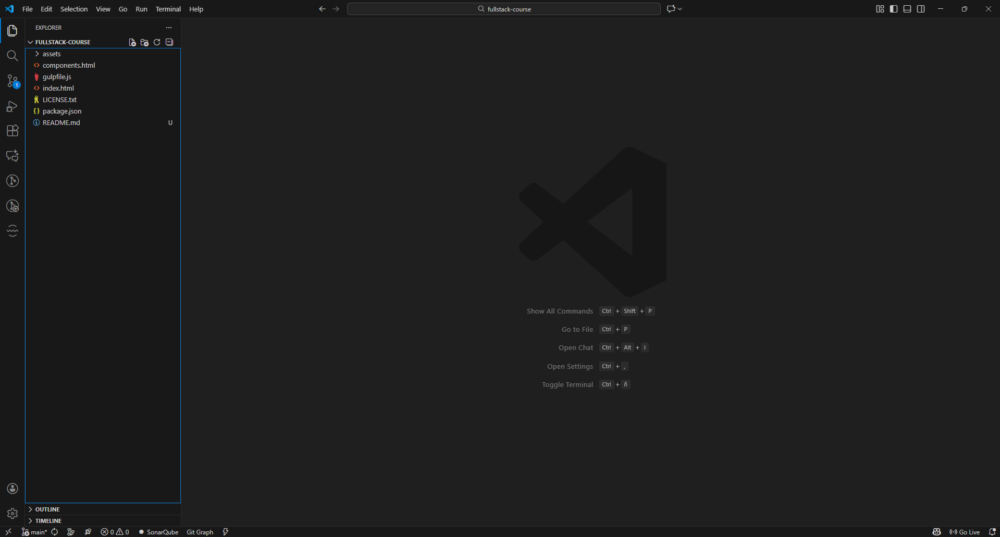
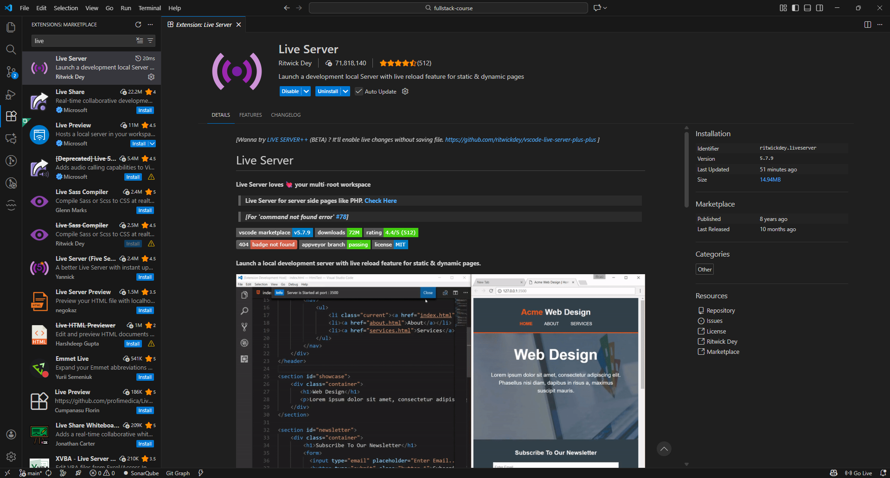

# Pizzarina

Este es un proyecto para aprender desarrollo web. Se utilizó una plantilla pública de una landing page de un restaurante.

### Tecnologías usadas

 - HTML
 - CSS
 - Javascript

### Instrucciones de instalación y visualización

1. Clonar el repositorio con el comando:
    `git clone https://github.com/SESASAN/entrega-1---web-y-git.git`

2. Abrir la carpeta con **Visual Studio Code**.
    
3. Instalar la extensión de **"Live Server"**.
    
3. Ubicarse en el archivo **"index.html"**.
    
4. Darle al botón **"Go Live"**.
    
5. Ver la página en el navegador.
    

### Autor original

##### *DevCRUD*
[Descarga la plantilla aquí](https://plantillashtmlgratis.com/todas-las-plantillas/plantilla/plantilla-html-gratuita-foodhut/)